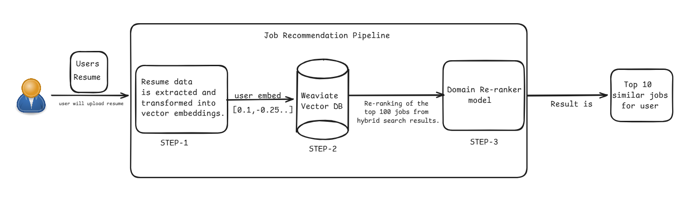

## *Job Recommendation System*

Recommendation systems are AI-based tools that analyze user behavior, preferences, and historical data to suggest relevant items such as products, movies, or music. They play a crucial role in personalizing user experiences, increasing engagement, and improving conversion rates. Popular platforms like Netflix (for movie recommendations), Amazon (for product suggestions), and Spotify (for music playlists) rely heavily on recommendation systems to help users efficiently discover content tailored to their interests.

In this project, I have built a Job Recommendation System where a user uploads their resume, and the system recommends the top 10 most relevant job opportunities based on the user’s skills, experience, and profile.

## **Motivation**
* To connect users with job opportunities that best match their skills, experience, and career interests, enabling them to find roles that are well-suited to their profiles.

## **DataSets**
Two different datasets were used:
* A dataset containing job-related information
* A dataset containing resumes
## **Links**
[Job dataset](https://www.kaggle.com/datasets/arshkon/linkedin-job-postings)

[Resume dataset](https://www.kaggle.com/datasets/snehaanbhawal/resume-dataset)

## *Methodology*
I explored two different approaches to solve this problem:

**1) Two-Tower Model**
The Two-Tower model is a scalable and widely used architecture for recommendation systems. However, it did not perform well in this use case due to the following reasons:
* Lack of user–job interaction data
* Clustering resulted in significant overlap across different job domains
* Difficulty in identifying meaningful hard negatives
* Despite training, the model suffered from overfitting

Due to these limitations, this approach was abandoned.

**2) Hybrid search with domain re-ranking** 
This approach uses a simpler yet more effective pipeline:
* The user uploads their resume
* Resume content is extracted and converted into vector embeddings
* A hybrid search (keyword + vector search) is performed to retrieve relevant jobs
* Retrieved jobs are re-ranked using a domain classification model

**Why this approach worked better:**
* No requirement for hard negatives
* Hybrid search combines semantic similarity and keyword relevance, improving * quality
* Fast retrieval leads to lower inference latency
* Domain re-ranking prioritizes the most relevant job roles
* The re-ranking model is trained on ~200,000 samples with balanced representation across domains, avoiding class imbalance
* Job diversity is maintained during the re-ranking process

## **End-to-End AI-Powered Job Recommendation Pipeline**

## **Demo Video**
[Job Recommendation Demo](https://youtu.be/Ms_kxvzgihs?si=O2YFeZkVsuoeXYkH)

